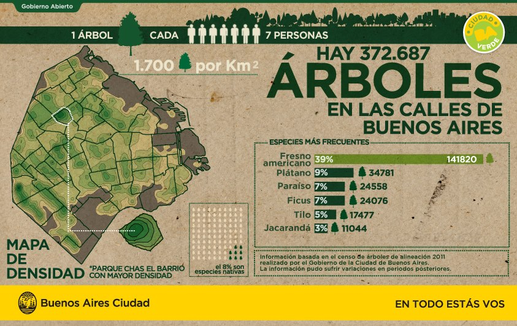

[Contenidos](../Contenidos.md) \| [Anterior (6 Contadores del módulo _collections_)](06_Contadores.md) \| [Próximo (8 Impresión con formato*)](08_Formato.md)

# 2.7 Arbolado porteño (integrador)

En esta sección haremos algunos ejercicios integradores manejando archivos, diccionarios, listas, contadores y el comando `zip`, entre otras cosas. Entregá lo que puedas hacer. No es obligatorio hacerlo completo...

## Ejercicios

Vamos a repasar las herramientas que vimos en esta clase aplicándolas a una base de datos sobre árboles en parques de la Ciudad de Buenos Aires. Para empezar, descargá el archivo CSV de "[Arbolado en espacios verdes](https://data.buenosaires.gob.ar/dataset/arbolado-espacios-verdes)" en tu carpeta `Data`. Vamos a estudiar esta base de datos y responder algunas preguntas. Guardá los ejericios de esta sección en un archivo `arboles.py`.

### Ejercicio 2.22: Lectura de los árboles de un parque
Definí una función `leer_parque(nombre_archivo, parque)` que abra el archivo indicado y devuelva una **lista de diccionarios** con la información sobre los árboles del parque especificado. La función debe devolver una lista que, por cada árbol (cada fila) del archivo, contenga un diccionario con toda la información sobre el árbol. 

_Sugerencia: basate en la función `leer_camion()` y usá también el comando `zip` como hiciste en el_ [Ejercicio 2.19](../02_Datos/05_Secuencias.md#ejercicio-219-la-función-zip) _para combinar el encabezado del archivo con los datos de cada fila. Por ahora te preocupes por los tipos de datos de cada columna._

_Observación: La columna que indica el nombre del parque en el que se encuentra el árbol se llama `'espacio_ve'` en el archivo CSV._

Probá con el parque "GENERAL PAZ" para tener un ejemplo de trabajo.

### Ejercicio 2.23: Determinar las especies en un parque
Escribí una función `especies(lista)` que tome una lista de árboles como la generada en el ejercicio anterior y devuelva el conjunto de especies (la columna `'nombre_com'` del archivo) que figuran en la lista.

_Ṣugerencia: Usá el comando `set` como en la [Sección 2.4](../02_Datos/04_Contenedores.md#conjuntos)._

### Ejercicio 2.24: Contar ejemplares por especie
Usando contadores como en el [Ejercicio 2.21](../02_Datos/06_Contadores.md#ejercicio-221-contadores), escribí una función `contar_ejemplares(lista_arboles)` que, dada una lista como la que generada con `leer_parque()`, devuelva un diccionario en el que las especies (recordá, es la columna `'nombre_com'` del archivo) sean las claves y tengan como valores asociados la cantidad de ejemplares en esa especie en la lista dada.

Luego, combiná esta función con `leer_parque()` y con el método `most_common()` para informar las cinco especies más frecuentes en cada uno de los siguientes parques:

- 'GENERAL PAZ'
- 'ANDES, LOS'
- 'CENTENARIO'

Resultados de cantidad por especie en tres parques:

General Paz | Los Andes | Centenario
-------------------------|-----------|--------------
Casuarina: 97 |Jacarandá: 117|Plátano: 137
Tipa blanca: 54|Tipa blanca: 28|Jacarandá: 45
Eucalipto: 49|Ciprés: 21|Tipa blanca: 42
Palo borracho rosado: 44 |Palo borracho rosado: 18|Palo borracho rosado: 41
Fenix: 40|Lapacho: 12|Fresno americano: 38

### Ejercicio 2.25: Alturas de una especie en una lista
Escribí una función `obtener_alturas(lista, especie)` que, dada una lista de árboles como la anterior y una especie de árbol (nuevamente, la columna `'nombre_com'` del archivo), devuelva una lista con las alturas (columna `'altura_tot'`) de los ejemplares de esa especie en la lista. 

_Observación: Acá sí, fijate de devolver las alturas como números (de punto flotante) y no como cadenas de caracteres_.

Usala para calcular la altura promedio y altura máxima de los 'Jacarandá' en los tres parques mencionados.

Resultado de alturasde Jacaranáes en tres parques:

Medida | General Paz | Los Andes | Centenario
-------|------------------|-----------|--------------
max  |16.0 |25.0  | 18.0
prom |10.2 |10.54 | 8.96

### Ejercicio 2.26: Inclinación promedio por especie de una lista
Escribí una función `obtener_inclinaciones(lista, especie)` que, dada una especie de árbol y una lista de árboles como la anterior, devuelva una lista con las inclinaciones (columna `'inclinacio'`) de los ejemplares de esa especie. 

### Ejercicio 2.27: Especies con ejemplares más inclinados

Combinando la función `especies()` con `obtener_inclinaciones()` escribí una función `especies_inclinadas(lista)` que, dada una lista de árboles devuelva la especie que tiene el ejemplar más inclinado así como la especie que tiene mayor promedio de inclinación entre las que figuran en la lista.

Correlo para los tres parques mencionados anteriormente.

Deberías obtener, por ejemplo, que en el Parque Centenario hay un _Falso Guayabo_ inclinado 80 grados y que los _Álamos Plateados_ del Parque Los Andes tiene un promedio de inclinación de 25 grados.

¿Qué habría que cambiar para obtener la especie con promedio más inclinado de toda la ciudad y no solo de un parque?

[Contenidos](../Contenidos.md) \| [Anterior (6 Contadores del módulo _collections_)](06_Contadores.md) \| [Próximo (8 Impresión con formato*)](08_Formato.md)

