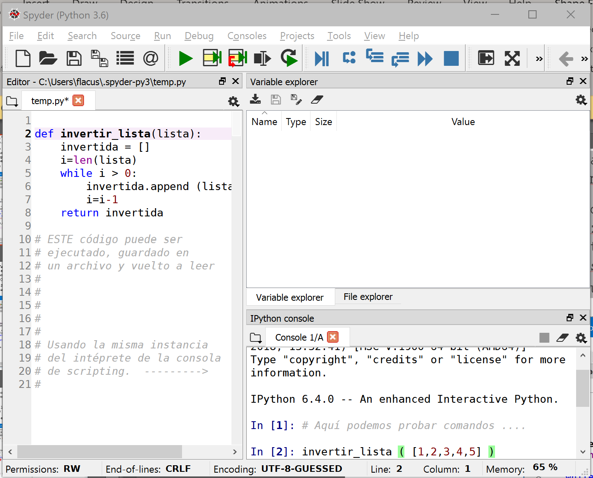
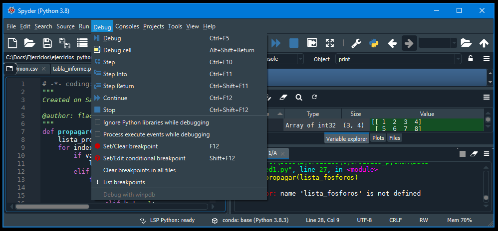
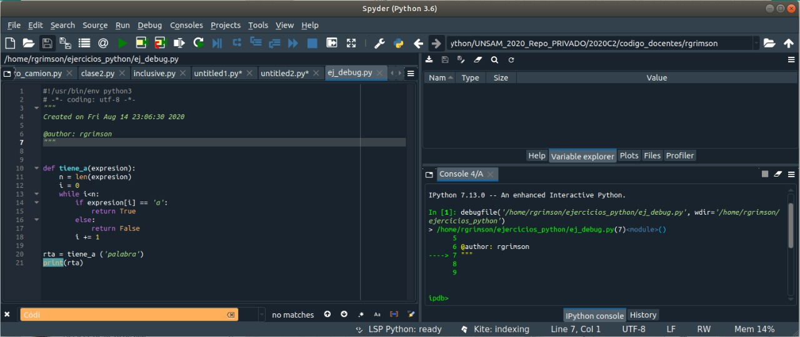
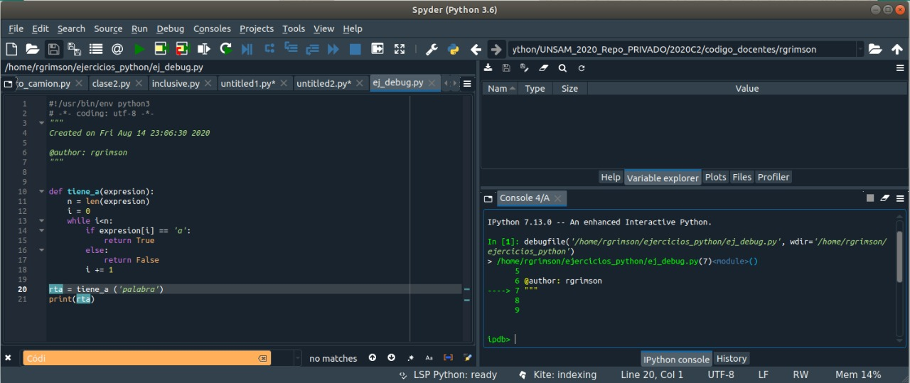
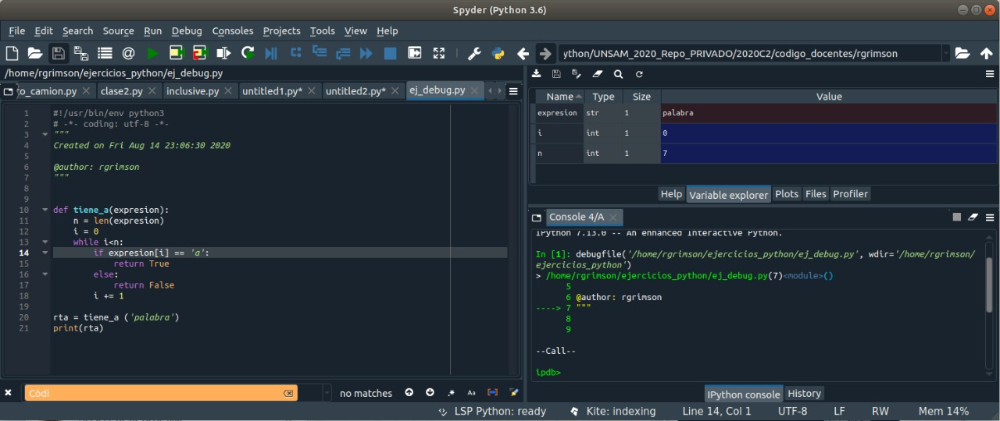
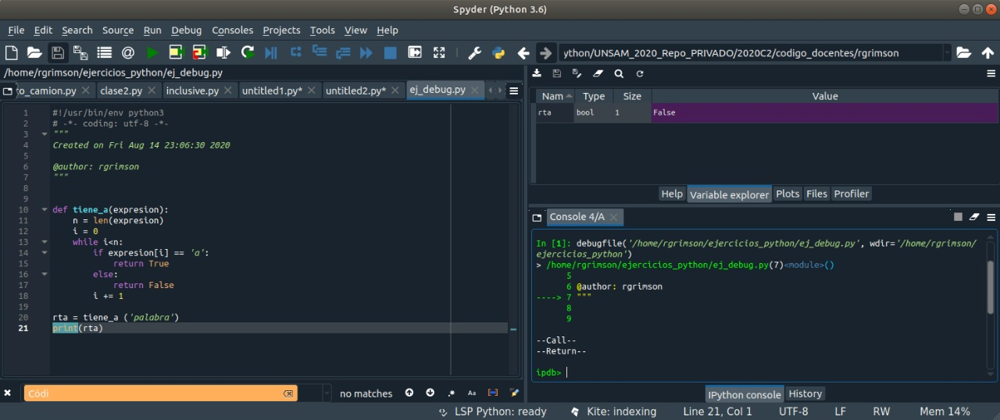

[Contenidos](../Contenidos.md) \| [Próximo (2 Random)](02_Random.md)

# 4.1 Debuggear programas

Python tiene un debugger poderoso que te permite probar porciones de código. Esto es sencillo y está integrado en IDEs como Spyder. 

Vimos en la  [Sección 3.2](../03_Listas_y_Listas/02_Bugs.md#tres-tipos-de-errores) diferentes ejemplos de problemas que pueden aparecer y tuviste que arremangarte e ingeniártelas para resovlerlos a mano. En esta sección vamos a introducir la herramientas *pdb* (Python debugger) que ofrece el lenguaje para resolver este tipo de problemas.


## Testear es genial, debuggear es un horrible.

Se dice que hay un _bug_ (un error) cuando un programa no se comporta como el programador espera o hace algo inesperado. Es muy frecuente que los programas tengan bugs. Después de escribir un fragmento de código por primera vez, es conveniente correrlo algunas veces usando tests que permitan poner en evidencia esos bugs.

Diseñar un conjunto de _tests_ adecuado no es una tarea sencilla y es frecuente que queden casos especiales que causen errores inesperados.

Python es un lenguaje interpretado, con tipos de datos dinámicos (una misma variable puede cambiar de tipo, de `int` a `float`, por ejemplo). No tiene un compilador que te alerte sobre inconsistencias de tipos antes de ejecutar el programa. Es bueno usar _buenas prácticas_ que minimicen estos potenciales errores pero igual es posible que algunos errores se filtren.

Testear consiste en ejecutar un programa o porción de código en condiciones controladas, con entradas conocidas y salidas predichas de forma de poder verificar si lo que da el algoritmos es lo que esperabas.

La ejecución de un algoritmo puede pensarse como un árbol (el árbol de ejecución del algoritmo, cada condición booleana da lugar a una ramificación del árbol). Según la entrada que le des, el programa se va a ejecutar siguiendo una rama u otra. Lo ideal es testear todas las ramas posibles de ejecución y que los casos de prueba (_test cases_) incluyan todos los casos _especiales_ (casos como listas vacías, índices apuntando al primer o al último elemento, claves ausentes, etc.) comprobando en cada caso que el programa se comporte según lo esperado.  



Los entornos de desarrollo integrado (como el Spyder) dan la posiblidad de combinar el uso de un intérprete de Python con un editor de código y suelen integrar también el uso del debugger. Aún con herramientas como el Spyder, hacer debugging es lento y tedioso. Antes de entrar en los detalles de cómo hacerlo, comentaremos algunos métodos que tratan de reducir su necesidad. Profundizaremos sobre estos métodos más adelante.  

### Aseveraciones (assert)

El comando `assert` se usa para un control interno del programa. Si la expresión que queremos verificar es `False`, se levanta una excepción de tipo `AssertionError`. La sintaxis de `assert` es la siguiente.

```python
assert <expresion> [, 'Mensaje']
```

Por ejemplo

```python
assert isinstance(10, int), 'Necesito un entero (int)'
```

La idea *no es* usarlo para comprobar la validez de lo ingresado por el usuario. El propósito de usar `assert` es verificar que ciertas condiciones se cumplan. En general se lo usa mientras el programa está en desarrollo, y luego se los quita o desactiva cuando el programa funciona.  

### Programación por contratos

Se llama `programación por contratos` a una forma de programar en la que le programadore  define, para cada parte del programa, el tipo y formato de datos con que llamarla y el tipo de datos que devolverá. 

Para asegurarse que los tipos de datos sean los esperados, el uso irrestricto de verificaciones puede ayudar en el diseño de software, y detecta tempranamente un error en los datos pasados a una función evitando que se propague.

Por ejemplo: podrías poner verificaciones para cada parámetro de una función.

```python
def add(x, y):
    assert isinstance(x, int), 'Necesito un entero (int)'
    assert isinstance(y, int), 'Necesito un entero (int)'
    return x + y
```

De este modo, una funcion puede verificar que todos sus argumentos sean válidos.

```python
>>> add(2, 3)
5
>>> add('2', '3')
Traceback (most recent call last):
...
AssertionError: Necesito un entero (int)
>>>
```


## El debugger de Python (pdb)

Es posible usar el debugger de Python directamente en el intérprete (sin interfaz gráfica) para seguir el funcionamiento de un programa. No vamos a entrar en esos detalles acá. Solo mencionamos que la función `breakpoint ()` inicia el debugger:

```python
def mi_funcion():
    ...
    breakpoint()      # Iniciar el debugger (Python 3.7+)
    ...
```

Podés encontrar instrucciones detalladas [acá](https://docs.python.org/3/library/pdb.html) sobre como usarlo. 

Nos resulta más cómodo usar un IDE como Spyder para hacer debugging y ése es el método que describiremos aquí. Este es el menú desplegable del debugger:



Fijate los nombres de cada ícono: 

Nombre | Acción
---|---
Debug | inicia el modo debug
Step | da un paso en el programa
Step Into | entra en la función referida
Step Return | ejecuta hasta salir de la función
Continue | retoma la ejecución normal
Stop | detiene el programa

Vamos a volver a analizar el siguiente código, similar al del [Ejercicio 3.1](../03_Listas_y_Listas/02_Bugs.md#ejercicio-31-semántica) para que veas la utilidad del debugger:


```python
def tiene_a(expresion):
    n = len(expresion)
    i = 0
    while i<n:
        if expresion[i] == 'a':
            return True
        else:
            return False
        i += 1

rta = tiene_a ('palabra')
print(rta)
```

Una vez que tengas el código copiado en el Spyder, vamos a ejecutarlo en _modo debug_:

Primero entramos al _modo debug_ (Ctrl+F5): El programa queda pausado antes de comenzar. Notá los cambios en la ventana interactiva.




Si damos un paso en el programa: ¿qué va a ocurrir? Debemos tratar de responder esta pregunta antes de avanzar cada paso. *Es nuestra predicción, contrastada con lo que realmente sucede, lo que delata el error*.

Queremos ver la evolución de las variables en la solapa _Variable Explorer_ (solapa del centro en el panel superior de la derecha). El programa está en ejecución pero pausado. Sabemos que estamos en _modo debug_ por el prompt `ipdb>` abajo.

Damos algunos pasos (con `Step`, Ctrl + F10) hasta llegar a la llamada a la función `tiene_a()` que queremos analizar. 



Fijate que el debugger pasó por la línea de definición de la función (y ahora sabe dónde ir a buscarla) pero nunca entró al cuerpo de la función aún. Eso va a ocurrir recién al llamarla.

A esta altura, no queremos simplemente dar un paso (eso ejecutaría la función entera, de una) sino entrar en los detalles de esta función. Para eso usamos `Step Into` (Ctrl + F11) de forma de entrar en la ejecución de la función `tiene_a()`. Una vez dentro, seguimos dando pasos (con `Step`, Ctrl + F10), siempre pensando qué esperamos que haga la función y observando la evolución de las variables en el explorador de variables. Sigamos así hasta llegar al condicional `if`. Vemos en el _Variable Explorer_ que todas las variables internas de la función están definidas y con sus valores asignados.



Como `i = 0` sabemos que es la primera iteración. Corroboramos que `n=7` (“palabra” tiene 7 letras). En este punto se evalúa `if palabra[i] == 'a':`, y saltaremos a alguna de las dos ramas de ejecución según la evaluación resulte `True` o `False`.


La expresión resulta `False` ya que la primera letra de 'palabra' es la 'p' y no una 'a'. Pero entonces, la siguiente instrucción será el `return False` con lo que saldremos de la función habiendo sólo evaluado la primera letra de la palabra pasada como parámetro. ¿Esto es lo que queríamos?



Acabamos de volver de la función. Las variables internas a la función ya no están visibles (salimos de su alcance o _scope_). El programa sigue en ejecución, en _modo debug_.

Si seguimos dando pasos con `Step` (Ctrl + F10) vamos a pasar por el `print()` y terminar la ejecución del programa, saliendo del _modo debug_.

Si, en cambio, al llegar a la línea del `print()` en lugar de `Step` (Ctrl + F10) avanzáramos con un `Step Into` (Ctrl + F11), entraríamos en los detalles de la definición de esta función y la cosa se pondría un toque técnica. Cuando esto ocurre es útil usar el `Step Return` (Ctrl + Shift + F11) para salir de tanto nivel de detalle.

En todo caso, lo que observamos en esta ejecución de `tiene_a()` es que salimos de la función después de haber analizado sólo la primera letra de la palabra. ¿Es correcto esto? ¿Donde está el error? ¿Cómo lo podemos resolver?

**Comentario.** Recorrer la ejecución de un programa como un simple expectador no nos muestra claramente un error en el código. Es la incongruencia entre lo esperado y lo que realmente sucede lo que lo marca. Esto exige mucha atención para, antes de ejecutar cada paso, preguntarse: ¿qué espero que ocurra? Luego, al avanzar un paso en la ejecución, puede ocurrir que lo que esperamos que pase no sea lo que realmente pasa. Entonces estamos en un **paso clave** de la  ejecución, que nos marca que estamos frente a una de dos: ó frente a un error en el código ó frente a la oportunidad de mejorar nuestra comprensión del mismo.

## Ejercicios

### Ejercicio 4.1: Debugger
Ingresá y corré el siguiente código en tu IDE:

```python
def invertir_lista(lista):
    '''Recibe una lista L y la develve invertida.'''
    invertida = []
    i=len(lista)
    while i > 0:    # tomo el último elemento 
        i=i-1
        invertida.append (lista.pop(i))  #
    return invertida

l = [1, 2, 3, 4, 5]    
m = invertir_lista(l)
print(f'Entrada {l}, Salida: {m}')
```

Deberías observar que la función modifica el valor de la lista de entrada. Eso no debería ocurrir: una función nunca debería modificar los parámetros salvo que sea lo esperado.  Usá el debugger y el explorador de variables para determinar cuál es el primer **paso clave** en el que se modifica el valor de esta variable.

### Ejercicio 4.2: Más debugger
Siguiendo con los ejemplos del [Ejercicio 3.1](../03_Listas_y_Listas/02_Bugs.md#ejercicio-31-semántica), usá el debugger para analizar el siguiente código:

```python
import csv
from pprint import pprint

def leer_camion(nombre_archivo):
    camion=[]
    registro={}
    with open(nombre_archivo,"rt") as f:
        filas = csv.reader(f)
        encabezado = next(filas)
        for fila in filas:
            registro[encabezado[0]] = fila[0]
            registro[encabezado[1]] = int(fila[1])
            registro[encabezado[2]] = float(fila[2])
            camion.append(registro)
    return camion

camion = leer_camion("Data/camion.csv")
pprint(camion)
```

Observá en particular lo que ocurre al leer la segunda fila de datos del archivo y guardarlos en la variable `registro` con los datos ya guardados en la lista `camion`.

## Análisis de alternativas para *propagar*

Los siguientes tres ejercicios porponen diferentes soluciones al [Ejercicio 3.9](../03_Listas_y_Listas/03_IteradoresLista.md#ejercicio-39-propagación) de propagación del fuego. Vamos a analizar sus diferencias y sus complejidades. Algunas soluciones tienen errores que deberás corregir oportunamente. ¡Usá el debugger de Python!

_Observación: Cuando te pidamos que cuentes cuántas operaciones hace una función, no nos va a importar el detalle de las constantes. Por ejemplo: si una función para una entrada de largo n hace n+2 operaciones y otra hace 3*n+5 nos va a importar que ambas hacen una cantidad **lineal** de operaciones en el tamaño de la entrada, pero no las constantes 2, 3 y 5 que figuran en cada caso. Diremos que la cantidad de operaciones es *O(n)* (se lee 'o de n'). En cambio, sí vamos a hacer una diferencia si una función hace n y otra hace n^2 operaciones (una va a tener complejidad *O(n)* y la otra O(n^2)*). Volveremos sobre estos temas más adelante._


### Ejercicio 4.3: Propagar por vecinos
El siguiente código propaga el fuego de cáda fósforo encendido a sus vecinos inmediatos (si son fósforos nuevos) a lo largo de toda la lista. Repite esto mientras sea necesario. ¿Cuántas operaciones puede tener que hacer, en el peor caso?

```python
def propagar_al_vecino(l):
    modif = False
    n = len(l)
    for i,e in enumerate(l):
        if e==1 and i<n-1 and l[i+1]==0:
            l[i+1] = 1
            modif = True
        if e==1 and i>0 and l[i-1]==0:
            l[i-1] = 1
            modif = True
    return modif

def propagar(l):
    m = l.copy()
    veces=0
    while propagar_al_vecino(l):
        veces += 1

    print(f"Repetí {veces} veces la función propagar_al_vecino.")
    print(f"Con input {l}")    
    print(f"Y obtuve  {m}")
    return m
#%%
propagar([0,0,0,0,1])
propagar([0,0,1,0,0])
propagar([1,0,0,0,0])
```

**Preguntas:**
1. ¿Por qué los tests `l[i+1]==0` y `l[i-1]==0` de la función `propagar_al_vecino` no causan un `IndexError` en los bordes de la lista?
2. ¿Por qué `propagar([0,0,0,0,1])` y `propagar([1,0,0,0,0])`, siendo entradas perfectamente simétricas, no generan la misma cantidad de repeticiones de llamadas a la función `propagar_al_vecino`?
3. Sobre la complejidad:
    * ¿Cuántas veces como máximo se puede repetir el ciclo while en una lista de largo n?
    * ¿Cuántas operaciones hace "propagar_al_vecino" en una lista de largo n?
    * Entonces, ¿cuántas operaciones hace como máximo esta versión de `propagar` en una lista de largo n? ¿Es un algoritmo de complejidad lineal o cuadrática?


### Ejercicio 4.4: Propagar por como el auto fantástico

El siguiente código propaga el fuego inspirado en las luces del [auto fantástico](https://www.youtube.com/watch?v=oNeQi8-PXAU).

```python
def propagar_a_derecha(l):
    n = len(l)
    for i,e in enumerate(l):
        if e==1 and i<n-1:
            if l[i+1]==0:
                l[i+1] = 1
    return l
#%
def propagar_a_izquierda(l):
    return propagar_a_derecha(l[::-1])[::-1]
#%
def propagar(l):
    ld=propagar_a_derecha(l)
    lp = propagar_a_izquierda(ld)
    return lp
#%%
l = [0,0,0,-1,1,0,0,0,-1,0,1,0,0]
print("Estado original:  ",l)
print("Porpagando...")
lp=propagar(l)
print("Estado original:  ",l)
print("Estado propagado: ",lp)
```

**Preguntas:**
1. ¿Por qué se modificó la lista original? 
2. ¿Por qué no quedó igual al `estado propagado`? 
3. Corregí el código para que no cambie la lista de entrada.
4. ¿Cuántas operaciones hace como máximo `propagar_a_derecha` en una lista de largo n?
5. Sabiendo que invertir una lista (`[::-1]`) requiere una cantidad lineal de operaciones en la longitud de la lista ¿Cuántas operaciones hace como máximo `propagar` en una lista de largo n?


### Ejercicio 4.5: Propagar con cadenas
Esta versión usa métodos de _cadenas_ para resolver el problema separando los fósforos en _grupos sin fósforos quemados_ y analizando cada grupo. Sin embargo algo falla...

```python
def trad2s(l):
    '''traduce una lista con 1,0 y -1 
    a una cadena con 'f', 'o' y 'x' '''
    d={1:'f', 0 :'o', -1:'x'}
    s=''.join([d[c] for c in l])
    return s

def trad2l(ps):
    '''traduce cadena con 'f', 'o' y 'x'
    a una lista con 1,0 y -1'''
    inv_d={'f':1, 'o':0, 'x':-1}
    l = [inv_d[c] for c in ps]
    return l

def propagar(l, debug = True):
    s = trad2s(l)
    if debug:
        print(s)#, end = ' -> ')
    W=s.split('x')
    PW=[w if ('f' not in w) else 'f'*len(w) for w in W]
    ps=''.join(PW)
    if debug:
        print(ps)
    return trad2l(ps)

#%%
l = [0,0,0,-1,1,0,0,0,-1,0,1,0,0]
lp = propagar(l)
print("Estado original:  ",l)
print("Estado propagado: ",lp)
```

**Preguntas:**
1. ¿Porqué se acorta la lista? 
2. ¿Podés corregir el error agregando un solo caracter al código?
3. ¿Te parece que este algoritmo es cuadrático como el [Ejercicio 4.3](../04_Random_Plt_Dbg/01_Debugger.md#ejercicio-43-propagar-por-vecinos)
o lineal como el [Ejercicio 4.4](../04_Random_Plt_Dbg/01_Debugger.md#ejercicio-44-propagar-por-como-el-auto-fantástico)?


[Contenidos](../Contenidos.md) \| [Próximo (2 Random)](02_Random.md)

