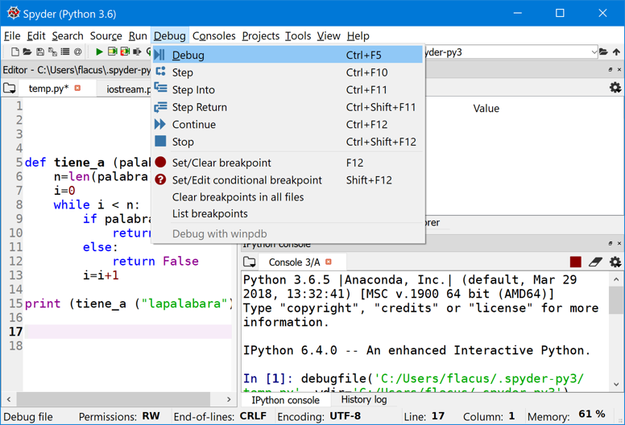
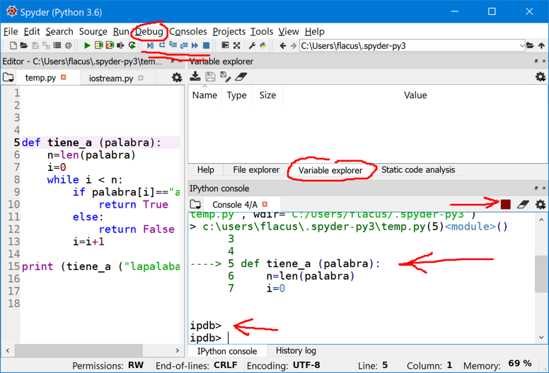
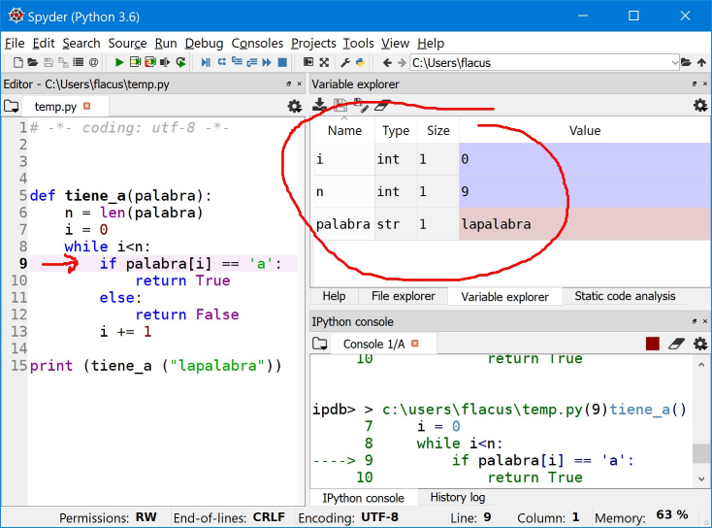
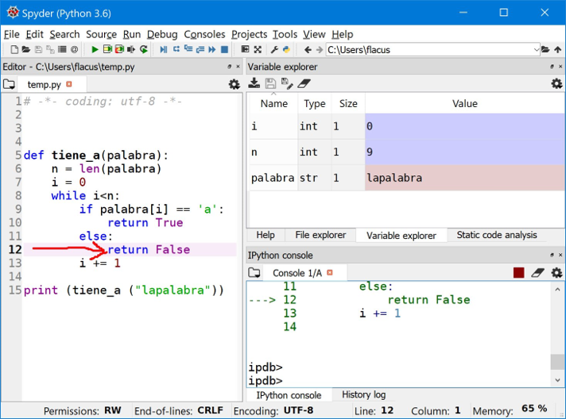
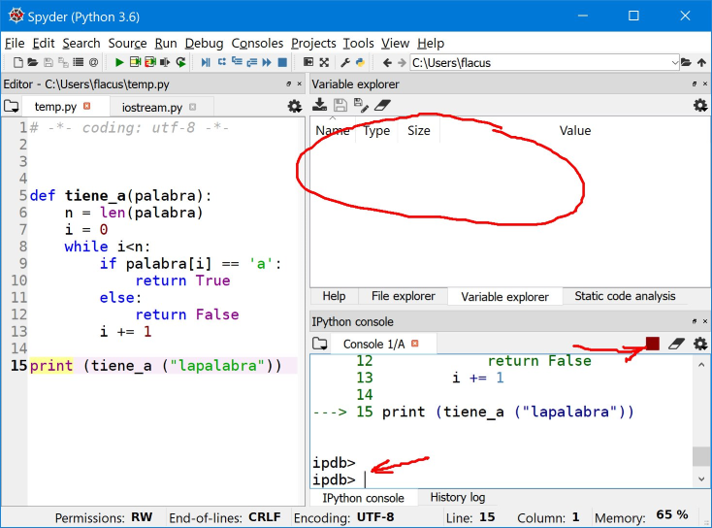
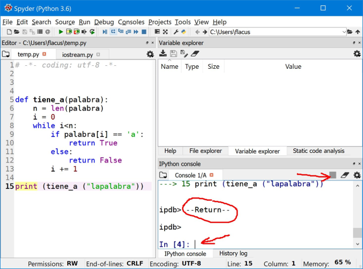

[Contenidos](../Contenidos.md) \| [Anterior (1 Control de errores)](01_Error_checking.md) \| [Próximo (3 Debuguear programas***)](02_debugger.md)

# 6.2 Debuguear programas+

En Python es muy fácil probar porciones de código. Especialmente si usás Spyder. Este fragmento de código puede parecer - a primera vista - que hace lo que "debe". Pero si lo miramos con detalle, o lo ejecutamos, veremos que no es tan fácil:

```python
def invertir_lista(lista):
	'''Recibe una lista L, develve otra lista invertida(L).'''
    invertida = []
    i=len(lista)
    while i > 0:    # tomo el último elemento 
        invertida.append (lista.pop(i))  #
        i=i-1
    return invertida
```

`invertir_lista` hace varias cosas mal, pero básicamente: no hace lo que debe, y hace lo que no debe.

Se dice que hay un "bug" (un error) cuando un programa no se comporta como el programador espera.

También se dice que un programa tiene un bug cuando un programa se comporta de un modo en que el programador no espera.

Un programa debe 
[1] hacer lo que debería hacer,
[2] no hacer lo que no debería hacer.

En general, todos los programas escritos tienen bugs de diversa índole. Después de escribir un fragmento de código por primera vez, uno suele "limpiarlo"  para casos que pueden poner en evidencia esos bugs.

Llega un momento en los programas son tan complejos que no es fácil "limpiarlos" o ver los casos especiales que pueden causar errores,

## Testear es genial, debuggear es un horrible.

Python es un lenguaje interpretado, con tipos de datos dinámicos. No existe un compilador que te alerte sobre errores de tipo de datos antes de ejecutar el programa. La forma de encontrar errores semánticos en tu programa es entonces ... ejecutar el programa !

Testear consiste en ejecutar un programa o porción de código en condiciones controladas, con entradas conocidas y salidas predichas.

Es importante hacer que el programa recorra todas las ramas de ejecución posibles y que los datos de prueba incluyan los casos "especiales", casos como listas vacías, índices apuntando al primer o al último elemento, diccionarios vacíos, claves ausentes, etccomprobando en cada caso que el programa se comporte exactamente según lo esperado.  


La posibilidad de hacer scripts hace este testeo muy simple, sobre todo si la combinamos con un IDE como el Spyder, que permite interpretar scripts y mantener un archivo con código simultáneamente.

Aún con herramientas como el Spyder, hacer debugging es lento y tedioso. Antes de entrar en detalles de Debugging, veremos métodos que minimizan la necesidad de hacerlo.   

## Verificaciones (assert)

El comando `assert` es un control interno del programa. Si la expresión que queremos verificar es `False` , se alza una excepción de tipo `AssertionError`. La sintaxis de `assert` es la siguiente.

```python
assert <expresion> [, 'Mensaje']
```

Por ejemplo

```python
assert isinstance(10, int), 'Necesito un entero (int)'
```

La idea *no es* usarlo para comprobar la validez de lo ingresado por el usuario. El propósito de usar `assert` es verificar que ciertas verdades , sobre rangos y tipos de valores, se cumplan. En general se lo usa mientras el programa está en desarrollo, y luego se los quita o desactiva cuando el programa funciona.  

### Programación por contratos

En llama `programación por contratos` a una forma de programar en la que le programadore  define, para cada parte del programa, el tipo y formato de datos con que llamarla y el tipo de datos que devolverá. 

Para asegurarse que los tipos de datos sean los esperados, el uso irrestricto de verificaciones puede ayudar en el diseño de software, y detecta tempranamente un error en los datos pasados a una función evitando que se propague.

Por ejemplo: podrías poner verificaciones para cada parámetro de una función.

```python
def add(x, y):
    assert isinstance(x, int), 'Necesito un entero (int)'
    assert isinstance(y, int), 'Necesito un entero (int)'
    return x + y
```

De este modo, una funcion puede verificar que todos sus argumentos sean válidos.

```python
>>> add(2, 3)
5
>>> add('2', '3')
Traceback (most recent call last):
...
AssertionError: Necesito un entero (int)
>>>
```

### Inline Tests

También podés usar verificaciones para pruebas simples que indican que un módulo del programa o una parte del hardware no están completamente rotos, y al menos responden.

```python
def sumar(x, y):
    return x + y

assert sumar(2,2) == 4
```

De este modo, el código y su verificación están en un mismo lugar. Como `assert` levanta una excepción si falla, *vas a ver la excepción al importar el módulo*, sin perder tiempo o recursos en procesarlos.

No les recomendamos esto como método estandard para testear errores. Esto es para comprobar que *no sale humo* al correr una porción de código. Además, es para errores "esporádicos" ó de baja probabilidad, difíciles de ver con sólo examinar el código. No está todo roto ? Ah, bueno, entonces sigamos.


# 8.3 Debugging

### Debugging 

Los errores en tiempo de ejecución (runtime) son los más difíciles de encontrar. Especialmente errores que sólo aparecen bajo cierta combinación particular de condiciones que resulta en que el programa no pueda continuar.

Si tu programa corre, pero no te dá el resultado que esperás, o "se cuelga" y no entendés porqué, tenés algunas herramientas. Lo primero que podés hacer es intentar entender la causa del error usando como punto de partida el "traceback":

```bash
python3 blah.py
Traceback (most recent call last):
  File "blah.py", line 13, in ?
    foo()
  File "blah.py", line 10, in foo
    bar()
  File "blah.py", line 7, in bar
    spam()
  File "blah.py", line 4, in spam
    line x.append(3)
AttributeError: 'int' object has no attribute 'append'
```
Lo que puede entenderse como "el objeto `int` no tiene un atributo `append` "- lo cual es obvio, pero como llegamos ahí. ?

###  ¿Que dice un traceback?

La última línea es el motivo concreto del error.

Las líneas anteriores te dicen el camino que siguió el programa hasta llegar al error. En este caso: El error ocurrió en `x.append(3)` en la línea 4 , dentro de la función `spam` del módulo `"blah.py"`, que fué llamado por la función `bar` en la línea 7 del mismo archivo, que fué llamada por .... y así siguiendo. 

Sin embargo a veces esto no proporciona suficiente información (por ejemplo, no sabemos el valor de cada parámetro usado en las llamadas.)

*CONSEJO: contále todo el traceback a Google.* Si estás usando una biblioteca de funciones que mucha gente usa (como `numpy` ó `math`) es muy probable que alguien se haya encontrado antes con el mismo problema que vos, y sepa qué lo causa, o cómo evitarlo. 

### Usá el modo [REPL](https://es.wikipedia.org/wiki/REPL) de Python 

Si al ejecutar Python le pasas un `-i` como parámetro antes del script a ejecutar, entonces cuando el script termine Python (en lugar de salir inmediatamente) se va a quedar esperando y respondiendo tus preguntas. Podés averiguar en qué estado quedó el sistema. 

```bash
python3 -i blah.py
Traceback (most recent call last):
  File "blah.py", line 13, in ?
    foo()
  File "blah.py", line 10, in foo
    bar()
  File "blah.py", line 7, in bar
    spam()
  File "blah.py", 4, in spam
    line x.append(3)
AttributeError: 'int' object has no attribute 'append'
>>>     print( repr(x) )
```

Este *switch* preserva el estado del intérprete al finalizar el script y te permite interrogarlo sobre el estado de las variables y obtener información que de otro modo perderías. En el ejemplo de recién interesa saber que es `x` y como llegó a ese estado. 

### Debugging con `print`

`print()` es una forma rápida y común de permitir que el programa ejecute (casi) normalmente mientas te dá información del estado de las variables. Si elegís bien las variables que mostrás, vas a decir "Ajá !!"

*Consejo: asegurate de usar `repr()`*

```python
def spam(x):
    print('DEBUG:', repr(x))
    ...
```

`repr()` te muestra una representación técnicamente mas precisa del valor de una variable, y no la representación *bonita* que solemos ver.  

```python
>>> from decimal import Decimal
>>> x = Decimal('3.4')
# SIN `repr`
>>> print(x)
3.4
# CON `repr`
>>> print(repr(x))
Decimal('3.4')
>>>
```

### Papel y lápiz
Muchas veces uno *asume* que el intérprete está haciendo algo. Si tomás un lápiz y un papel y "hacés de computadora" anotando el estado de cada variable y siguiendo las instrucciones del programa para modificarlas te das cuenta de que las cosas no son como creías.

Si no encontras el problema con `assert` ni con prints, ni con papel y lápiz, sólo te queda una alternativa. 

### El debugger de Python

Podés iniciar a mano el debugger dentro de un programa en Python, no nos vamos a explayar aquí, pero es posible usarlo manualmente, sin interfaz gráfica, para seguir el funcionamiento de un programa. 

```python
def mi_funcion():
    ...
    breakpoint()      # Iniciar el debugger (Python 3.7+)
    ...
```

La función `breakpoint ()` inicia el debugger. Vas a encontrar [instrucciones detalladas](https://docs.python.org/3/library/pdb.html) sobre como usarlo. 

Aunque esto funciona es mucho mas agradable usar un IDE como Spyder para hacer debugging y ése es el método que describiremos aquí. Fijate los nombres de cada ícono: 
	Debug: 			inicia el modo debug.
	Step:  			da un paso en el programa
	Step Into: 		entra en la función referida
	Step Return: 	ejecuta hasta salir de la función
	Continue: 		retoma la ejecución normal
	Stop: 			detiene el programa.  



Vamos a usar el siguiente código para que veas la utilidad del debugger:

```python
def tiene_a(palabra):
	n = len(palabra)
	i = 0
	while i < n:
		if palabra[i] == 'a':
			return True
		else:
			return False
		i += 1

print (tiene_a ('palabra'))
```

Una vez que tengas el código, vamos a ejecutarlo en modo Debug:

Primero entramos al modo DEBUG:  (Ctrl+F5) El programa queda pausado antes de comenzar. Notá los cambios en la ventana interactiva.

Si damos un paso en el programa: qué va a ocurrir ? Esta pregunta siembre debe preceder a avanzar. *Es nuestra predicción, contrastada con lo que realmente sucede, lo que delata el error*.



Queremos ver la solapa Variable Explorer (centro, derecha). Sabemos que el programa está en ejecución pero pausado por el “Stop” rojo de la derecha. Sabemos que estamos en modo DEBUG por el prompt “ipdb” abajo.



Pedimos algunos Step Into (Ctrl + F11) hasta llegar a la línea 9. Vemos que todas las variable internas de la función están definidas y con sus valores asignados (arriba, derecha).

Como i=0 sabemos que es la primera iteración. Corroboramos que n=7 (“palabra” tiene 7 letras). En este punto se evalúa `if palabra[i] == 'a':`, y saltaremos a alguna de las dos ramas de ejecución según la evaluación resulte True o False.



La expresión resulta `False`, lo que concuerda con lo esperado porque palabra[0] es “p” lo cual es distinto de 'a'.

La próxima instrucción será RETURN !!! conlo que saldremos de la function y aún no evaluamos mas que la primera posición. Esto es lo que deseamos ?

Para no entrar dentro del `return` que es complicada pedimos un Step (Ctrl + F10 ó F12)



Acabamos de volver de la function. Las variables internas a la función ya no están visibles (salimos de su "scope"). El programa sigue en ejecución, (flechas).

Salir de la función después de haber analizado solo la primera letra no era lo deseado. Que pasó ? A pensar !



El programa terminó. Las flechas indican el STOP apagado y el prompt normal. Tenemos control del IDE y la tarea ahora es pensar porqué la función terminó antes de lo deseado.

### Comentario
Recorrer la ejecución de un programa como un simple expectador no te va a ayudar e encontrar el error. Es la incongruencia entre lo predicho y lo que realmente sucede lo que nos abre los ojos. Es una tarea que exije mucha atención, pero bien hecha delata el error en una sóla pasada.

### Ejercicio 6.4: Debugger
Ingresá el siguiente código en el IDE, tal como está. Es el mismo del principio de esta sección. 

```python
def invertir_lista(lista):
	'''Recibe una lista L, develve otra lista invertida(L).'''
    invertida = []
    i=len(lista)
    while i > 0:    # tomo el último elemento 
        invertida.append (lista.pop(i))  #
        i=i-1
    return invertida
```
Ahora usá el debugger para ver cada uno de los errores, y devolver el código corregido. Acordate: Que haga lo que debe y no haga lo que no debe.

Vas a encontrar: problemas con el índice `i`  , y problemas con la manipulación de la lista `lista`, que debería quedar intacta.


[Contenidos](../Contenidos.md) \| [Anterior (1 Control de errores)](01_Error_checking.md) \| [Próximo (3 Debuguear programas***)](02_debugger.md)

